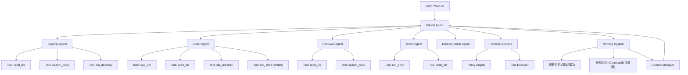
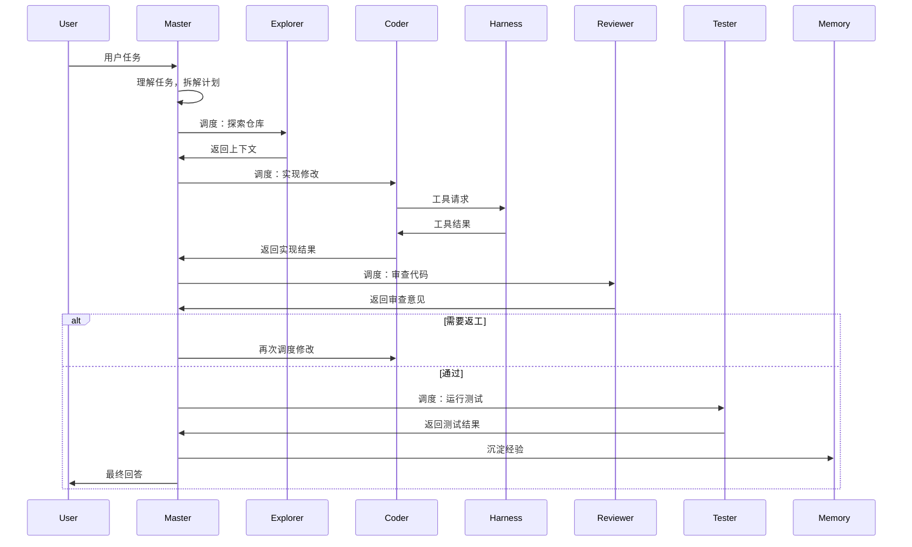

# 系统架构与模块设计

## 1. 一句话架构定义

本项目可以定义为：

`一个以 Master Agent 为调度核心、Specialist Agent 为执行单元、Harness 为执行控制平面的多智能体 Coding Assistant`

这句话的含义是：
- `Master Agent` 负责任务理解、拆解、调度、整合
- `Specialist Agent` 负责各自领域的专精执行
- `Harness Runtime` 负责受控执行与安全策略
- `Memory System` 负责上下文治理与经验复用

## 2. 总体架构图



## 3. 为什么从 Workflow 改造为 Master-Specialist

第一版采用了固定的 StateGraph 工作流（Planner → Explorer → Coder → Reviewer → Tester），这种模式适合流程固定的场景，但存在几个问题：

- 路由逻辑硬编码在条件边函数中，扩展新 Agent 需要改图结构
- 所有 Agent 平级，没有一个统一的"大脑"做全局判断
- 工具权限与 Agent 绑定松散，难以做到精细控制
- 不适合动态决策场景（如"根据任务类型决定是否要探索仓库"）

改造后：

- `Master Agent` 是唯一的决策中枢，通过 LLM 判断"下一步做什么"
- `Specialist Agent` 只执行不决策，各自持有专精工具集
- 新增 Agent 只需注册到 Master 的调度列表中，无需改图结构

## 4. 核心模块说明

### Master Agent

中文作用：
- 理解用户目标
- 拆解为子任务
- 按需调度 Specialist Agent
- 整合各 Specialist 输出
- 管理记忆读写
- 生成最终回答

核心能力：
- 判断"当前阶段，需要调用哪个 Specialist"
- 将 Specialist 的输出整合进全局上下文
- 在任务结束时调用 Memory Writer 沉淀经验

### Specialist Agents

每个 Specialist Agent 是"专精执行者"，不具备流程决策权。

| Agent | 专精领域 | 可用工具 |
|-------|---------|---------|
| Explorer | 仓库探索、代码搜索、文件定位 | read_file, search_code, list_directory |
| Coder | 代码修改、文件写入、受控命令 | read_file, write_file, list_directory, run_shell |
| Reviewer | 代码审查、风险发现 | read_file, search_code |
| Tester | 测试执行、结果验证 | run_shell, read_file |

### Memory System

详见 [04_运行时与记忆系统设计.md](04_运行时与记忆系统设计.md)

分层结构：
- 短期记忆：当前会话的滑动窗口消息 + 当前任务上下文
- 长期记忆：ChromaDB 向量库持久化的结构化经验条目

### Harness Runtime

中文作用：
- 作为唯一高风险执行入口
- 负责策略、审批、执行、审计

### LLM Client

中文作用：
- 封装大模型 API 调用
- 提供 OpenAI 兼容接口（阿里云百炼 qwen3.6-plus）

## 5. 协作范式

正式采用：

`Master-Specialist + HITL Approval`

### 协作流程



## 6. 模块边界原则

- `Master Agent` 不直接调用文件或 shell 工具，只做调度与决策
- `Specialist Agent` 不决策流程，只执行自己被分配的任务
- `Agent` 不直接越过 Harness Runtime 执行副作用动作
- `Runtime` 是唯一高风险执行入口
- `Memory` 不控制流程，只提供记忆与上下文能力
- `Policy` 先于执行，`Approval` 高于执行

## 7. 四种运行模式

### Ask 模式

路径：
- Master → Explorer（可选）→ 回答用户

中文解释：
- 只读问答，不改代码

### Plan 模式

路径：
- Master → 输出计划 → 结束

中文解释：
- 只输出计划与风险

### Act 模式

路径：
- Master → Explorer → Coder → Reviewer → Tester → Memory → 回答
- 含返工回路：Reviewer/Coder 之间可循环

中文解释：
- 真实执行任务的主模式

### Review 模式

路径：
- Master → Explorer → Reviewer → 回答

中文解释：
- 代码审查模式，默认只读

## 8. 第一阶段与第二阶段实现范围

### 第一阶段（当前 MVP）

已实现：
- Master Agent 调度框架
- 5 个 Specialist Agent
- 工具分发与 Harness Runtime
- LLM 集成与 CLI

### 第二阶段（本次改造）

新增：
- Master Agent 动态调度（LLM 驱动路由，取代硬编码条件边）
- 按 Agent 裁剪工具权限
- 长短时记忆系统（ChromaDB）
- 上下文压缩（滑动窗口 + LLM 摘要）
- Web 交互界面

---

## 9. Web 交互界面设计

### 9.1 设计目标

- 提供 VS Code 风格的多面板布局，降低学习成本
- 实时展示 Agent 调用链和执行进度
- 支持模式切换、工作目录选择、审批交互
- 提供调试面板，方便追踪 LLM 决策和工具调用细节

### 9.2 页面布局

```
┌──────────────────────────────────────────────────────────────┐
│  🛠 Multi-Agent Coding Assistant          [状态: 空闲]        │  ← 标题栏
├──────┬───────────────────────────────────────────────────────┤
│      │  [Ask] [Plan] [Act ●] [Review]   📁 /home/project  ▶ │  ← 操作栏
│  🔍  │  ─────────────────────────────────────────────────── │
│  📂  │  Master Agent                                      │
│  🧠  │  ┌─ 理解任务：实现用户登录模块                       │
│  ⚙️   │  ├─ 拆解为 3 个子任务                               │  ← 主区域
│      │  ├─ → Explorer: 探索现有 auth 代码                   │  对话流
│ 活动  │  │  └─ ✅ 发现 auth.py, user.py                     │
│ 栏   │  ├─ → Coder: 实现 login() 函数                      │
│      │  │  ├─ 🔧 read_file auth.py                          │
│      │  │  ├─ 🔧 write_file auth.py                         │
│      │  ｜  └─ ✅ 修改完成                                   │
│      │  ├─ → Reviewer: 审查修改                             │
│      │  │  └─ ✅ 审查通过                                   │
│      │  └─ ✅ 任务完成                                      │
│      ├──────────────────────────────────────────────────────┤
│      │  📋 输出  │  🔒 审批  │  🧠 记忆  │  🐛 调试       │  ← 底部面板
│      │  [15:30:23] Explorer → read_file(auth.py) ✓         │  多标签
│      │  [15:30:25] Coder → write_file(auth.py) ✓           │
│      │  [15:30:28] Reviewer → review: 通过                  │
├──────┴──────────────────────────────────────────────────────┤
│  模式: Act  │  当前: Coder  │  步骤: 3/5  │  Token: 1,234  │  ← 状态栏
└──────────────────────────────────────────────────────────────┘
```

### 9.3 面板说明

#### 操作栏

| 元素 | 说明 |
|------|------|
| 模式选择按钮 | Ask / Plan / Act / Review，单选，当前模式高亮 |
| 工作目录选择 | 输入框 + 浏览按钮，选择项目根目录 |
| 运行按钮 | ▶ 开始执行 / ⏸ 暂停 / ⏹ 终止 |
| 输入框 | 用户输入任务描述，支持多行 |

#### 活动栏（左侧图标菜单）

| 图标 | 面板 | 说明 |
|------|------|------|
| 🔍 | 搜索 | 文件搜索 + 代码搜索，用于调试时快速定位 |
| 📂 | 文件树 | 当前工作目录的文件结构，点击可查看文件内容 |
| 🧠 | 记忆 | 查看 ChromaDB 中存储的记忆条目，按类型过滤 |
| ⚙️ | 设置 | 模型选择、API Key 配置、安全策略配置 |

#### 主区域（对话流）

核心交互区域，以时间线形式展示 Agent 调用过程：

- **Master 节点**：显示为"思考中 → 决策 → 调度"卡片
- **Specialist 节点**：显示为"执行中 → 工具调用 → 结果"卡片
- **流式输出**：LLM 输出逐 token 渲染
- **颜色编码**：
  - 🟦 Master 决策（蓝色）
  - 🟩 Explorer（绿色）
  - 🟧 Coder（橙色）
  - 🟨 Reviewer（黄色）
  - 🟪 Tester（紫色）
  - ⬜ 系统事件（灰色）

#### 底部面板（多标签）

| 标签 | 内容 | 调试价值 |
|------|------|---------|
| **输出** | 实时 tool 调用日志（时间戳 + 工具名 + 参数摘要 + 结果） | 追踪每个工具的调用链路 |
| **审批** | 高风险操作审批请求面板（显示动作详情 + 风险等级 + 批准/拒绝按钮） | 审批交互 |
| **记忆** | 本次检索到的长期记忆条目 + 滑动窗口状态 + 当前上下文大小 | 检查记忆系统是否正常工作 |
| **调试** 📌 | Agent LLM 原始决策 JSON + prompt 上下文 + token 消耗 | 核心调试面板 |

#### 调试面板设计（重点）

```
┌─ 调试面板 ─────────────────────────────────────────────┐
│  ▶ 当前 Agent: Coder（第 2 轮）                        │
│                                                        │
│  ┌─ Prompt 上下文 ──────────────────────────────────┐  │
│  │ agent_name: coder                                │  │
│  │ task_goal: 实现用户登录模块                       │  │
│  │ context_bundle: {auth.py 结构, user.py 字段...}   │  │
│  │ relevant_plan_steps: ["Step 2: 实现 login()"]    │  │
│  │ task_memory: ["用户密码使用 bcrypt 加密"]          │  │
│  │ available_tools: [read_file, write_file, ...]    │  │
│  │ recent_tool_results: [read_file auth.py → ok]    │  │
│  └──────────────────────────────────────────────────┘  │
│                                                        │
│  ┌─ LLM 原始输出 ───────────────────────────────────┐  │
│  │ {                                                 │  │
│  │   "summary": "正在修改 auth.py 添加 login 函数",  │  │
│  │   "next_action": "request_tool",                  │  │
│  │   "proposed_tool_request": {                      │  │
│  │     "tool_name": "write_file",                    │  │
│  │     "arguments": { "path": "auth.py", ... },      │  │
│  │     "risk_level": "medium",                       │  │
│  │     "requires_approval": false                    │  │
│  │   }                                               │  │
│  │ }                                                 │  │
│  └──────────────────────────────────────────────────┘  │
│                                                        │
│  ├─ Token: 输入 2,340 / 输出 156 / 总计 2,496          │
│  ├─ 耗时: 1.2s                                        │
│  └─ [重试此步骤] [查看历史] [修改 prompt 重发]          │
└────────────────────────────────────────────────────────┘
```

调试面板的价值：
- 看到每个 Agent 收到的**完整 prompt 上下文**（排查"Agent 为什么做出这个决定"）
- 看到 LLM 的**原始 JSON 输出**（排查"格式不对/字段缺失"问题）
- 看到**token 消耗**（优化上下文大小）
- 支持**重试**（修改 prompt 或直接重新调用）

### 9.4 交互流程

```
用户打开页面
  → 选择工作目录（📂 → 浏览 → 选择）
  → 选择模式（Act）
  → 输入任务 → 点击运行
  → 主区域流式输出 Agent 执行过程
  → 右侧/底部面板实时更新 tool 日志
  → 如果需要审批 → 底部审批面板弹出 → 用户批准/拒绝
  → 任务完成 → 状态栏变为"完成"
  → 可切换到"记忆"面板查看本次沉淀的记忆
```

### 9.5 状态栏

| 项目 | 说明 |
|------|------|
| 模式 | 当前运行模式（Ask/Plan/Act/Review） |
| 当前 Agent | 当前正在执行的 Agent 名称 |
| 步骤 | 当前步骤 / 总步骤数 |
| 状态 | 空闲 / 运行中 / 审批等待 / 完成 / 失败 |
| Token | 本次会话累计 token 消耗 |
| 耗时 | 本次运行总耗时 |
