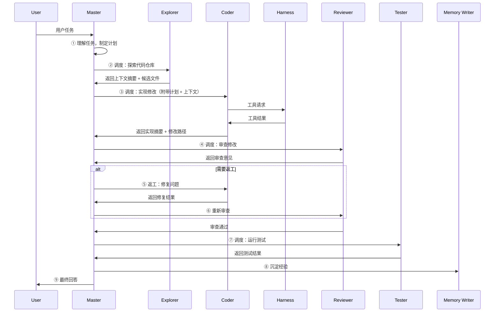
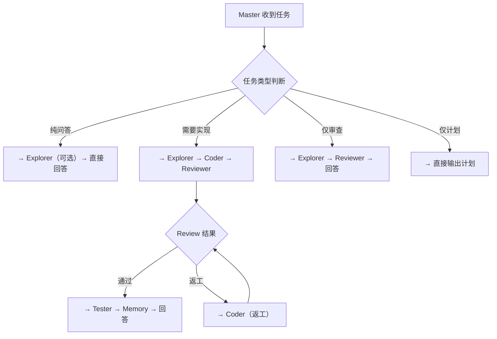
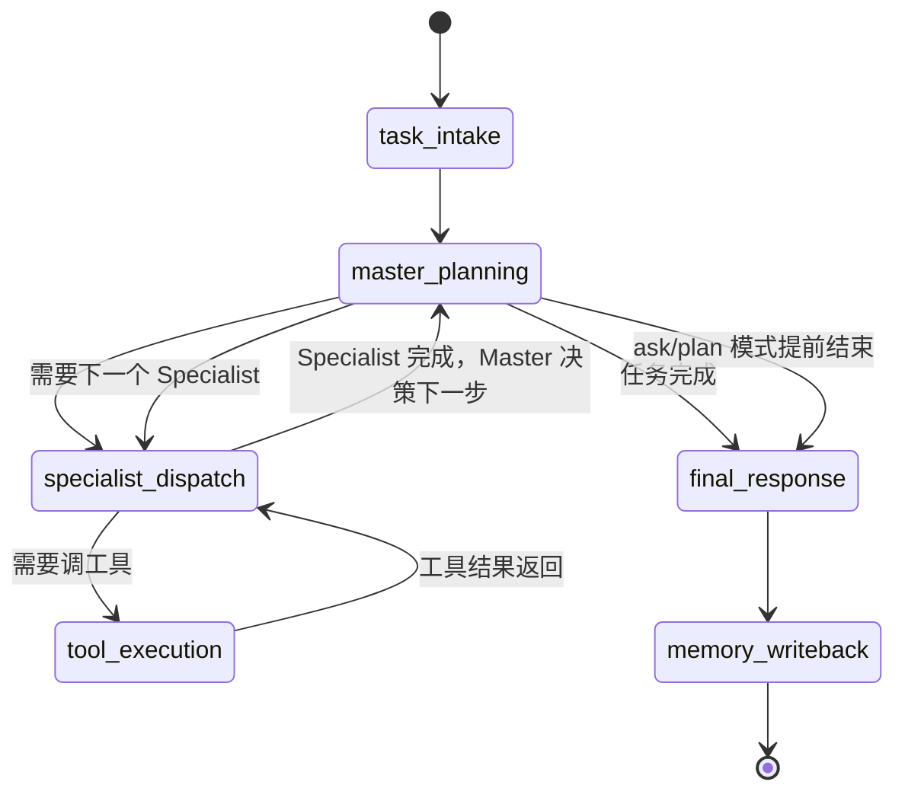

# 智能体协作、状态流转与权限设计

## 1. 智能体体系

系统采用 `Master-Specialist` 双层智能体结构。

### Master Agent（主控智能体）

**定位**：唯一的决策中枢。

**中文作用**：
- 理解用户目标
- 拆解为子任务
- 按需调度 Specialist Agent
- 整合各 Specialist 输出
- 管理记忆读写
- 生成最终回答

**协作方式**：
- Master 每次只调用一个 Specialist
- Specialist 执行完毕后将结果返回 Master
- Master 根据结果判断下一步（调下一个 Specialist / 要求返工 / 直接结束）
- Specialist 之间不直接通信

**核心输出**：
- `task_goal`
- `plan`
- `next_specialist`（下一步要调用的 Specialist 名称）
- `context_bundle`（传递给 Specialist 的上下文包）
- `final_answer`

### Specialist Agents（专业智能体）

每个 Specialist Agent 是"专精执行者"，不具备流程决策权。

| Agent | 专精领域 | 可调用工具 |
|-------|---------|-----------|
| Explorer | 仓库探索、代码搜索、文件定位 | `read_file`, `search_code`, `list_directory` |
| Coder | 代码修改、文件写入、受控命令 | `read_file`, `write_file`, `list_directory`, `run_shell` |
| Reviewer | 代码审查、风险发现 | `read_file`, `search_code` |
| Tester | 测试执行、结果验证 | `run_shell`, `read_file` |
| Memory Writer | 经验沉淀、记忆写入 | 不调工具，只返回结构化记忆条目 |

## 2. 协作流程

### 典型协作链路



### Master 调度决策流程



## 3. 状态流转设计

### 顶层阶段

1. `Task Intake` — 接收用户输入
2. `Planning` — Master 拆解任务、制定计划
3. `Specialist Dispatch` — Master 调度各 Specialist
4. `Tool Execution` — Specialist 调用工具（经 Harness Runtime）
5. `Review` — Reviewer 审查
6. `Testing` — Tester 验证
7. `Memory Writeback` — 经验沉淀
8. `Final Response` — 整合输出

### 状态图



与第一版的关键区别：
- 不再有硬编码的 `route_after_*` 条件边
- 路由决策由 Master Agent 的 LLM 调用动态输出
- Specialist Dispatch 是一个通用节点，Master 决定"派谁"和"传什么上下文"

## 4. 权限等级

### L0 Read Only

中文解释：
- 纯只读权限

允许：
- 读文件
- 搜索代码
- 读 diff
- 读日志

### L1 Low-risk Execution

中文解释：
- 低风险执行权限

允许：
- 只读 shell 命令（如 `pytest --collect-only`）
- 静态检查
- 测试发现

### L2 Controlled Write

中文解释：
- 受控写入权限

允许：
- 修改工作区文件
- 应用补丁
- 运行受控开发命令

### L3 High-risk Execution

中文解释：
- 高风险执行权限（需审批）

包括：
- 删除文件
- 危险 shell（rm -rf 等）
- 联网访问
- 工作区外路径操作

## 5. 角色-工具权限矩阵

| 角色 | 默认权限 | read_file | search_code | list_directory | write_file | run_shell |
|------|---------|-----------|-------------|---------------|------------|-----------|
| Master | L0 | ❌ | ❌ | ❌ | ❌ | ❌ |
| Explorer | L0 | ✅ | ✅ | ✅ | ❌ | ❌ |
| Coder | L2 | ✅ | ❌ | ✅ | ✅ | ✅（受限） |
| Reviewer | L0/L1 | ✅ | ✅ | ❌ | ❌ | ❌ |
| Tester | L1 | ✅ | ❌ | ❌ | ❌ | ✅ |

说明：
- Master 不直接调用任何文件/工具工具，只做调度与决策
- Coder 的 `run_shell` 受限为只允许白名单命令（如 `python`, `pytest`, `npm test` 等）
- 高风险操作（`rm -rf`、`git push --force` 等）需要 HITL 审批

## 6. 模式-权限矩阵

| 模式 | 默认权限 | 说明 |
|------|---------|------|
| Ask | L0 | 只读理解 |
| Plan | L0 | 只做规划 |
| Act | L2 | 允许受控执行 |
| Review | L0/L1 | 以审查为主 |

## 7. 返工策略

### 7.1 返工流程

在 Master-Specialist 架构下，返工由 Master Agent 自主判断：

```
Master 调 Reviewer
  → Reviewer 返回: {result: "fail", issues: ["module_a.py 缺少边界检查"]}
  → Master 判断："这个问题确实需要修复"
  → Master 调 Coder（附带 issues 作为上下文）
  → Coder 修复 → 返回修改结果
  → Master 调 Reviewer（再次审查）
  → 循环直到通过或达到上限
```

Master 决定是否返工的依据：
- Reviewer/Tester 指出的问题是否合理
- 修复难度与当前剩余返工次数
- 整体任务进展（已经花了多少步）

### 7.2 三层上限控制

```python
class RetryPolicy:
    soft_limit: int = 3    # Master 可自由决策
    hard_ceiling: int = 5  # 路由函数强制截断
```

| 层级 | 次数 | 行为 |
|------|------|------|
| 软上限以内 | 1-3 次 | Master 自由决定是否返工，无需额外逻辑 |
| 软上限到硬上限 | 4-5 次 | Master 可以继续，但每次必须说明"为什么要再试" |
| 硬上限被触发 | ≥5 次 | 路由函数直接截断，返回 `force_finalize`，强制输出结果 |

### 7.3 路由拦截机制

```python
def route_master(state: GraphState) -> str:
    """Master 调度路由，含硬上限保护。"""
    decision = state.get("last_decision", {})
    next_agent = decision.get("next_agent", "finalize")
    agent = next_agent

    # 硬上限检测：路由层直接截断，不依赖 LLM 判断
    retries = state.get("retry_count", {})
    if retries.get(agent, 0) >= 5:
        return "force_finalize"

    return agent
```

这样保证：
- 正常返工由 Master 灵活控制
- 超出硬上限时，路由层（几行纯逻辑）直接截断，不给 LLM 任何绕过的机会

## 8. 审批设计

以下动作进入审批：
- 修改配置或部署文件
- 删除文件
- 运行未知脚本
- 联网访问
- 工作区外路径操作
- 高风险 shell 命令

审批内容需要向用户展示：
- 谁发起的
- 准备做什么
- 涉及哪些路径或命令
- 风险等级
- 预期影响

### 8.1 实现机制

审批流程采用 LangGraph 原生 `interrupt` 机制实现：

```
Specialist 请求工具
  → route_after_specialist 检查 risk_level
    → risk_level=high → execute_tool_approval 节点
      → interrupt() 挂起图执行，等待用户决策
      → 审批通过 → execute_tool 执行工具
      → 审批驳回 → 注入 ToolResult(success=False) → 回 Master 重新决策
    → risk_level≠high → execute_tool 直接执行
```

关键文件：
- `orchestrator/master_router.py` — `route_after_specialist` 分流
- `orchestrator/nodes.py` — `execute_tool_approval` 节点实现
- `orchestrator/router.py` — `route_after_tool_approval` 路由
- `runtime/policy_engine.py` — 策略引擎评分

## 9. 状态字段建议

核心状态至少包含：

- `mode` — 运行模式
- `status` — 运行状态
- `current_stage` — 当前阶段
- `current_agent` — 当前 Agent
- `plan` — 执行计划
- `retry_count` — 返工计数
- `approval_pending` — 审批状态
- `artifacts` — 工件引用
- `review_notes` — 审查记录
- `test_summary` — 测试摘要
- `trace_events` — Trace 事件记录
- `final_answer` — 最终回答
