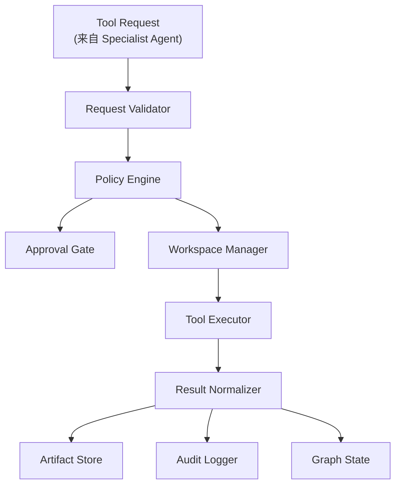
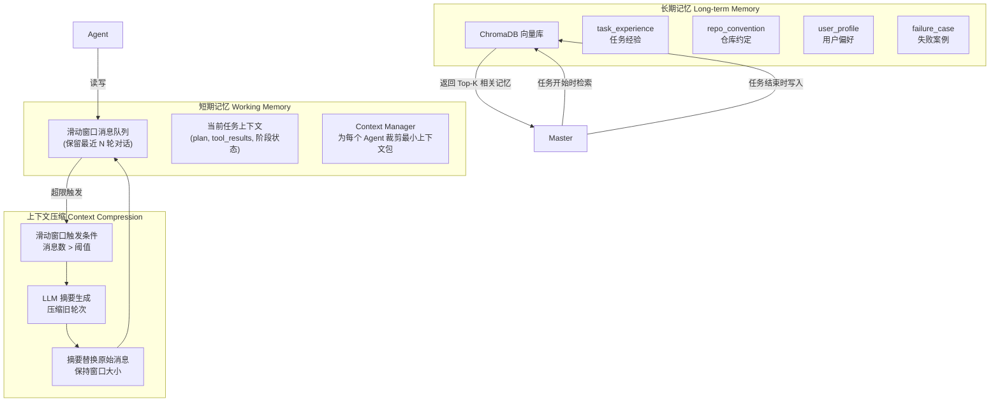
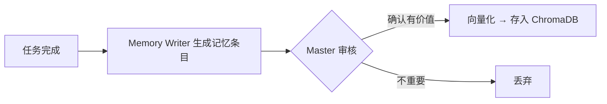
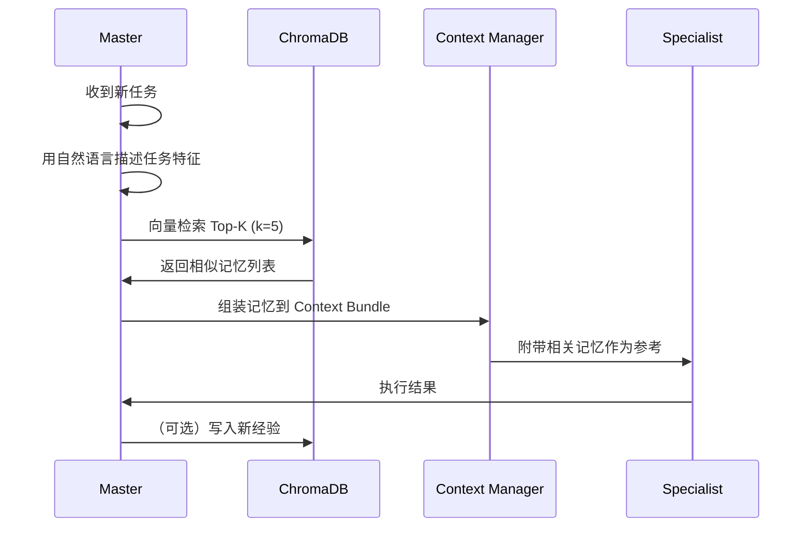
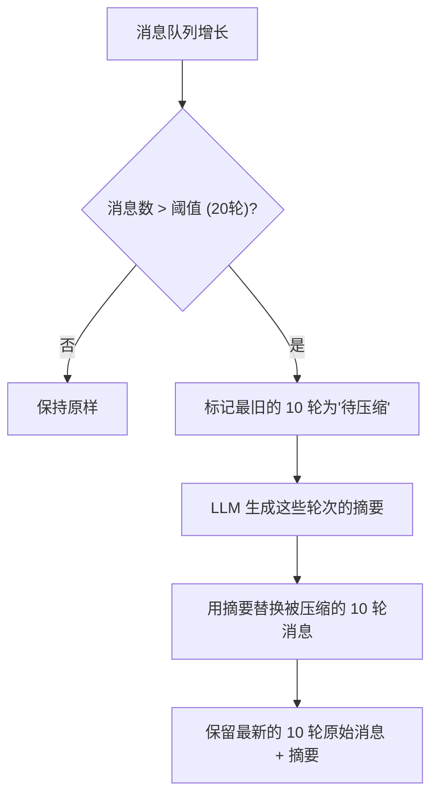

# 运行时与记忆系统设计

## 1. 这份文档管什么

这份文档集中定义两类底层能力：

- `Harness Runtime`
- `Memory System`

它们之所以放在同一份文档里，是因为二者都属于"支撑层"：
- Runtime 负责安全执行
- Memory 负责上下文治理和经验复用

---

## 第一部分：Harness Runtime

## 2. Harness Runtime 设计

### 2.1 核心定位

Harness Runtime 是系统的执行控制平面。

中文解释：
- 它决定一个动作能不能做、在哪里做、需不需要审批、怎么安全执行

English role:
- controlled execution gateway

### 2.2 组成结构



### 2.3 子模块作用

#### Request Validator

中文作用：
- 校验 tool request 的结构是否合法
- 标准化请求参数
- 确认请求来自有权限的 Agent

#### Policy Engine

中文作用：
- 根据 Agent 角色、模式、路径、命令、风险级别判断是否允许执行

决策结果：
- `allow`
- `allow_with_approval`
- `deny`

#### Approval Gate

中文作用：
- 对高风险动作进行人工确认
- 通过 LangGraph `interrupt()` 实现暂停与恢复

#### Workspace Manager

中文作用：
- 保证执行在受控工作区中进行
- 限定所有文件操作在用户指定的工作目录内

#### Tool Executor

中文作用：
- 真正执行命令、读写文件
- 控制超时、输出大小

#### Result Normalizer

中文作用：
- 将原始执行结果标准化
- 大结果写入 artifact，只把摘要回填给 graph

#### Audit Logger

中文作用：
- 记录谁在什么时候做了什么
- 支持审计与回放

### 2.4 设计原则

- 所有副作用动作必须经过 Runtime
- 默认只读
- 默认最小权限
- 默认越界拒绝
- 默认高风险需审批

### 2.5 工具注册与权限绑定

参见 [03_智能体协作_状态流转与权限设计.md](./03_智能体协作_状态流转与权限设计.md) 第 5 节"角色-工具权限矩阵"。

工具注册时需声明：
- 工具名称与参数 schema
- 允许调用的 Agent 角色列表
- 默认风险等级
- 是否为副作用操作

---

## 第二部分：Memory System

## 3. Memory System 设计

### 3.1 核心定位

记忆系统不是"聊天历史越多越好"，而是按照 Claude Code 的设计思路，围绕三层结构展开：

```
存什么（What to store）
    ↓
怎么存（How to store）
    ↓
怎么用（How to retrieve & use）
```

### 3.2 记忆分层结构



### 3.3 存什么：记忆类型定义

#### 短期记忆（Working Memory）

保存在内存中，随会话结束而消失。

| 内容 | 说明 | 管理方式 |
|------|------|---------|
| 消息历史 | 用户与系统的对话轮次 | 滑动窗口（保留最近 20 轮） |
| 当前计划 | Master 制定的执行计划 | 当前任务周期 |
| 工具结果摘要 | 最近 N 个 tool 的 stdout/stderr 预览 | 每次工具执行后更新 |
| 当前阶段 | running / needs_approval / completed | 实时状态 |

#### 长期记忆（Long-term Memory）

持久化存储在 ChromaDB 中，跨会话可复用。

每条记忆是一个结构化条目，包含以下字段（对应 `MemoryEntry` schema）：

```python
class MemoryEntry:
    memory_id: str           # 唯一标识
    memory_type: str         # 类型: task_experience / repo_convention / user_profile / failure_case
    title: str               # 标题
    content: str             # 内容（也会被向量化）
    scope: str               # 作用域: user / repo / task-pattern
    source_run_id: str       # 来源运行 ID
    tags: list[str]          # 标签，辅助检索
    created_at: str          # 创建时间
    embedding: list[float]   # 向量嵌入（由 ChromaDB 自动管理）
```

**各类型说明：**

| 类型 | 存什么 | 谁产生 | 谁消费 |
|------|-------|--------|--------|
| `task_experience` | 做完一个任务后的总结、关键发现、实现思路 | Memory Writer | Master（下次类似任务） |
| `repo_convention` | 代码库约定、命名规范、架构规则 | Explorer / Master | Master / Coder |
| `user_profile` | 用户偏好、常用配置、风格偏好 | Master | Master |
| `failure_case` | 失败原因、踩坑记录、规避方法 | Memory Writer | Master（预防同样问题） |

### 3.4 怎么存：存储架构

#### 技术选型：ChromaDB

选择理由：
- 嵌入式向量数据库，无需单独部署服务
- 支持本地持久化到磁盘
- 自动管理 embeddings（可搭配 SentenceTransformer 或直接存储）
- Python 原生，pip install chromadb 即可使用
- 适合桌面端 coding assistant 场景

#### 存储结构

按 `memory_type` 拆分为 4 个独立 Collection，各类型在各自的向量空间中检索，互不干扰。

```
ChromaDB 持久化路径: .claude/memory/chromadb/

Collections（按 memory_type 拆分）:
  ├── task_experience    # 任务经验
  ├── repo_convention    # 仓库约定
  ├── user_profile       # 用户偏好
  └── failure_case       # 失败案例

每条记录的 metadata 包含:
  - title, scope, source_run_id, tags, created_at
  - 用于过滤和元数据检索

每条记录的 document 包含:
  - content（被自动向量化）
```

选择 4 个独立 Collection 而非单集合 + metadata 过滤的理由：
- 不同类型记忆的向量空间差异大（"用户偏好"和"失败案例"是两回事），分开检索更精确
- 各 Collection 后续可独立配置不同的 embedding 模型
- 查询单一类型时不需要加额外的 metadata 过滤条件
- 跨类型查询只需要并行查 4 个集合后合并结果

#### 写入流程



写入时机：
- 每个 Act 模式任务完成后，由 Memory Writer Agent 生成总结
- Master Agent 判断是否有长期记忆价值
- 关键失败或修复（测试失败 → 修复成功）自动沉淀为 `failure_case`

### 3.5 怎么用：检索与集成

#### 检索流程



#### 检索触发时机

| 时机 | 检索什么 | 用途 |
|------|---------|------|
| **任务启动时** | `task_experience`, `user_profile` | 理解任务背景，参考类似经验 |
| **按需检索（Master 触发）** | 任意类型 | Coder 改代码时 Master 觉得需要查经验，可临时触发检索 |
| **探索仓库时** | `repo_convention` | 理解代码约定、命名规范 |
| **审查代码时** | `failure_case`, `repo_convention` | 发现潜在问题，参考历史踩坑 |
| **任务完成时** | 无（写入） | 沉淀新经验 |

按需检索是 Master Agent 在调度过程中主动发起的。例如：

```
Master 调 Coder 做修改
  → Coder 返回结果（修改涉及数据库层）
  → Master 判断："这个场景以前可能踩过坑"
  → Master 主动触发检索: retrieve("数据库迁移失败案例", type="failure_case")
  → 命中历史记录 → Master 将经验附加到 Reviewer 的上下文中
  → Master 调 Reviewer（带着历史经验去审查）
```

#### 检索策略

- 使用 ChromaDB 的 `query` 方法，传入自然语言描述
- 返回 Top-5 最相关的记忆条目
- 按 `confidence` 和 `recency` 排序
- Context Manager 将结果组装进 Agent 的输入上下文中

### 3.6 上下文压缩

#### 为什么要压缩

Agent 的输入上下文有限，对话轮次和工具结果如果无限增长，会导致：
- LLM 注意力分散
- Token 成本上升
- 关键信息被淹没

#### 压缩策略：滑动窗口 + LLM 摘要



#### 具体规则

1. **滑动窗口大小**：保留最近 10 轮完整对话 + 前置摘要
2. **触发条件**：当消息队列超过 20 轮时触发压缩
3. **压缩方式**：
   - 最旧的 N 轮（N=消息数-10）由 LLM 生成一段摘要
   - 用摘要替换这些轮次
   - 保留最近 10 轮的完整消息
4. **压缩时机**：
   - 每次 Specialist 执行完毕后
   - 每次工具调用后
5. **摘要内容**：
   - 用户的核心诉求
   - 已经完成的关键步骤
   - 当前进度和剩余任务
   - 重要的工具执行结果

#### 三层摘要体系（设计参考）

```
preview: 一句话概览（用于快速定位）
summary: 一段摘要（用于常规推理）
raw_ref: 指向完整内容的引用（需要时回读）
```

第一阶段先实现 `summary` 级别，后续再丰富。

### 3.7 第一阶段实现范围

#### 短期记忆

- [x] 滑动窗口消息队列
- [x] 当前任务上下文
- [ ] Context Manager 裁剪（需要实现）
- [ ] 摘要压缩触发与 LLM 调用（需要实现）

#### 长期记忆

- [ ] ChromaDB 集成与集合管理（需要实现）
- [ ] MemoryEntry 写入流程（需要实现）
- [ ] 向量检索与 Top-K 召回（需要实现）
- [ ] Context Manager 集成检索结果（需要实现）

## 4. Runtime 与 Memory 的关系

二者在几个点上配合：

- Runtime 执行结果进入短期记忆（工具结果摘要）
- 任务结束时，高价值结果通过 Memory Writer 沉淀为长期记忆
- 新任务启动时，长期记忆被检索出来辅助 Master Agent 决策

可以理解成：

- Runtime 管"动作怎么安全发生"
- Memory 管"结果怎么稳定复用"
