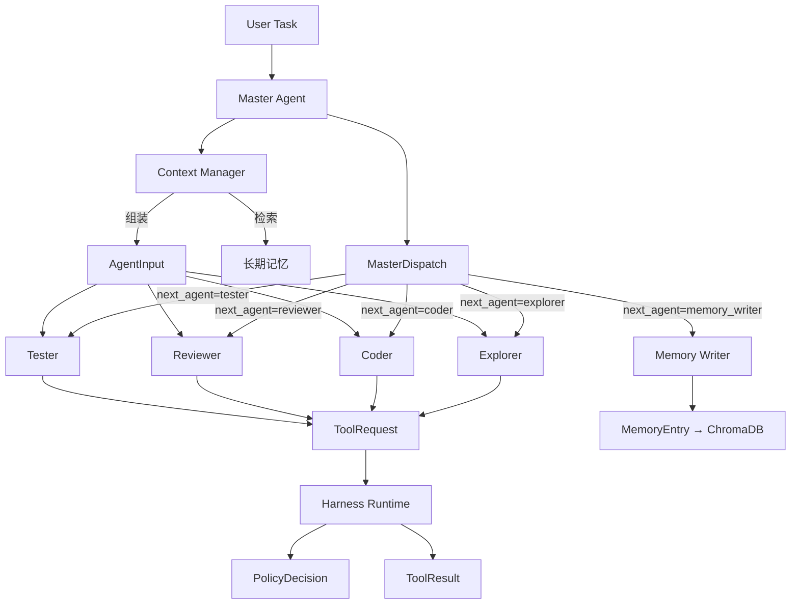

# 核心数据结构设计

## 1. 这份文档的作用

这份文档定义系统中最重要的几类核心数据结构。

目标是让以下模块共享同一套“语言”：
- `LangGraph Orchestrator`
- `Agents`
- `Tool Registry`
- `Harness Runtime`
- `Memory System`
- `Observability`

如果这一步不先定清楚，后面代码实现很容易出现：
- 状态字段乱长
- 工具调用结构不统一
- 权限判断难以落地
- 记忆写回难以追踪

## 2. 设计原则

- schema 要能覆盖 MVP，但不要一开始过度复杂
- 所有关键动作都要可追踪
- 所有高风险执行都要能被策略层理解
- 大对象尽量通过 `artifact_ref` 引用
- 长期记忆必须有来源与作用域

## 3. 总览

第一阶段建议先正式定义以下 7 类核心结构：

1. `GraphState`
2. `AgentDecision`
3. `ToolRequest`
4. `ToolResult`
5. `MemoryEntry`
6. `PolicyDecision`
7. `TraceEvent`

## 4. GraphState

### 4.1 作用

`GraphState` 是整个系统在 LangGraph 中流转的主状态对象。

中文解释：
- 它是工作流的大脑记忆
- 保存当前任务到哪一步了、做了什么、还差什么

### 4.2 设计目标

它应该能表达：
- 当前任务
- 当前阶段
- 当前计划
- 当前上下文
- 工具调用摘要
- 审查/测试结果
- 审批状态
- 记忆引用

### 4.3 推荐字段

```python
class GraphState(TypedDict, total=False):
    thread_id: str
    run_id: str
    mode: Literal["ask", "plan", "act", "review"]
    status: Literal["pending", "running", "needs_approval", "failed", "completed"]
    current_stage: str
    current_agent: str
    retry_count: dict[str, int]

    user_input: str
    task_goal: str
    constraints: list[str]
    success_criteria: list[str]
    plan: list[str]

    messages: list[dict[str, Any]]
    agent_contexts: dict[str, Any]

    tool_requests: list[ToolRequest]
    tool_results: list[ToolResult]

    artifacts: list[str]
    review_notes: list[str]
    test_summary: list[str]

    approval_pending: bool
    approval_context: dict[str, Any]

    task_memory: list[str]
    memory_refs: list[str]

    trace_events: list[TraceEvent]  # Phase 5 新增：Trace 事件记录

    final_answer: str
```

### 4.4 字段解释

`mode`
- 当前运行模式
- 用于决定流程与权限边界

`current_stage`
- 当前所处阶段，如 planning / implementation / testing

`current_agent`
- 当前主要执行的 agent

`retry_count`
- 记录 review/test 等返工次数

`agent_contexts`
- 给不同 agent 预留的上下文摘要空间

`artifacts`
- 只保留引用 id，不在 state 中存大对象

`approval_context`
- 保存待审批动作信息

`task_memory`
- 当前任务内沉淀的临时结论

## 5. AgentDecision

### 5.1 作用

`AgentDecision` 表示某个 agent 在当前轮次做出的结构化决策。

中文解释：
- 不是自然语言闲聊，而是 agent 的正式输出

### 5.2 推荐字段

```python
class AgentDecision(TypedDict, total=False):
    agent_name: str
    summary: str
    next_action: Literal[
        "continue",
        "request_tool",
        "handoff",
        "retry",
        "finalize",
        "need_approval",
    ]
    reasoning_notes: list[str]
    proposed_tool_request: ToolRequest
    update_fields: dict[str, Any]
    risk_summary: str
```

### 5.3 字段解释

`summary`
- 本轮 agent 结论摘要

`next_action`
- 告诉 orchestrator 下一步怎么走

`update_fields`
- 允许 agent 用结构化方式更新 state 局部字段

`risk_summary`
- 方便在 review/approval 中复用

## 6. ToolRequest

### 6.1 作用

`ToolRequest` 是 agent 发给 Harness Runtime 的标准化执行请求。

中文解释：
- 它是“我要调用工具”的正式工单

### 6.2 设计目标

它必须让 Runtime 在不看完整 prompt 的情况下，仍然能做出安全决策。

### 6.3 推荐字段

```python
class ToolRequest(TypedDict, total=False):
    request_id: str
    thread_id: str
    run_id: str

    agent_name: str
    mode: str
    current_stage: str

    tool_name: str
    arguments: dict[str, Any]

    intent_summary: str
    related_plan_step: str

    risk_level: Literal["low", "medium", "high"]
    side_effect: bool
    requires_approval: bool

    target_paths: list[str]
    target_command: str
    network_scope: list[str]
```

### 6.4 关键字段解释

`intent_summary`
- 说明为什么要调用这个工具

`related_plan_step`
- 让 Runtime 和审计层知道这个动作对应哪一步计划

`target_paths`
- 让 Policy Engine 能直接做路径检查

`target_command`
- 用于 shell 命令模板匹配

`network_scope`
- 用于限制联网目标范围

## 7. ToolResult

### 7.1 作用

`ToolResult` 是 Runtime 返回给 Graph 的标准化结果。

中文解释：
- 不管底层工具多么不同，回来的结构尽量统一

### 7.2 推荐字段

```python
class ToolResult(TypedDict, total=False):
    request_id: str
    tool_name: str

    success: bool
    summary: str

    stdout_preview: str
    stderr_preview: str

    artifact_refs: list[str]
    modified_paths: list[str]

    duration_ms: int
    exit_code: int

    policy_trace: dict[str, Any]
    execution_metadata: dict[str, Any]
```

### 7.3 关键字段解释

`summary`
- 给 agent 的简洁结论

`stdout_preview / stderr_preview`
- 避免把全部原始输出塞进 state

`artifact_refs`
- 指向完整原始结果

`policy_trace`
- 记录本次执行命中了什么策略

## 8. MemoryEntry

### 8.1 作用

`MemoryEntry` 是长期记忆中的标准条目结构。

中文解释：
- 它决定系统“记住什么”和“怎么记”

### 8.2 推荐字段

```python
class MemoryEntry(TypedDict, total=False):
    memory_id: str
    memory_type: Literal[
        "user_profile",
        "repo_convention",
        "task_experience",
        "failure_case",
    ]
    title: str
    content: str

    scope: Literal["user", "repo", "task-pattern"]
    confidence: float

    source_run_id: str
    source_artifact_refs: list[str]

    created_at: str
    updated_at: str
    expiry_policy: str
    tags: list[str]
```

### 8.3 关键字段解释

`memory_type`
- 限制长期记忆分类，避免无序增长

`scope`
- 决定这条记忆适用于谁或什么场景

`confidence`
- 控制这条记忆复用时的权重

`source_artifact_refs`
- 方便追溯这条记忆是从哪里提炼出来的

## 9. PolicyDecision

### 9.1 作用

`PolicyDecision` 是 Policy Engine 对一个工具请求做出的判断结果。

中文解释：
- 它告诉 Runtime：可以执行、要审批，还是直接拒绝

### 9.2 推荐字段

```python
class PolicyDecision(TypedDict, total=False):
    decision: Literal["allow", "allow_with_approval", "deny"]
    reason: str
    risk_level: Literal["low", "medium", "high"]
    matched_rule: str
    requires_approval: bool
    safe_alternative: str
```

### 9.3 字段解释

`matched_rule`
- 记录命中了哪条策略

`safe_alternative`
- 在拒绝时给 agent 或用户一个更安全的替代建议

## 10. TraceEvent

### 10.1 作用

`TraceEvent` 是 Trace 系统中的统一事件结构，记录每次 Agent 调用、工具执行、审批决策等关键事件。

中文解释：
- 它让系统内部的执行过程可观察、可调试
- 每一条 Trace 事件都可以在 Debug 面板的时间线 Tab 上展示

### 10.2 推荐字段

```python
class TraceEvent(TypedDict):
    event_type: str     # task_start / task_end / agent_start / agent_end /
                        # tool_execution / master_dispatch / approval
    agent: str          # 关联的 Agent 名称
    summary: str        # 人类可读的事件描述
    timestamp: str      # 事件发生时间（ISO 格式）
    duration_ms: int    # 持续时间（毫秒），瞬时事件为 0
```

### 10.3 事件类型

| event_type | 触发点 | 说明 |
|-----------|--------|------|
| `task_start` | `task_intake` | 任务开始 |
| `agent_start` | `make_agent_node` | Agent 被调用 |
| `agent_end` | `make_agent_node` | Agent 执行完毕 |
| `tool_execution` | `execute_tool` | 工具执行 |
| `master_dispatch` | `apply_decision` | Master 调度 Specialist |
| `approval` | `execute_tool_approval` | 审批决策（通过/驳回） |
| `task_end` | `finalize` | 任务完成 |

## 11. 可选扩展结构

第一阶段可以先不正式实现，但建议提前预留概念：

### ArtifactMeta

作用：
- 管理 artifact 的元信息

建议字段：
- `artifact_id`
- `artifact_type`
- `summary`
- `source_request_id`
- `storage_path`

### ApprovalRequest

作用：
- 规范发给用户的审批消息

建议字段：
- `approval_id`
- `request_id`
- `agent_name`
- `action_summary`
- `risk_summary`

## 12. 结构之间的关系

整体关系可以理解为：

- `GraphState` 是主状态容器
- `AgentDecision` 是 agent 的结构化输出
- `ToolRequest` 是执行请求
- `ToolResult` 是执行反馈
- `PolicyDecision` 是安全决策
- `MemoryEntry` 是长期记忆单元

## 13. 第一阶段实现建议

建议先在代码里正式落地这 6 个结构：

1. `GraphState`
2. `AgentDecision`
3. `ToolRequest`
4. `ToolResult`
5. `MemoryEntry`
6. `PolicyDecision`

并优先放在：

`src/multi_agents/schemas/`

## 14. 为什么这一步很重要

对这个项目来说，schema 设计其实就是“系统语言设计”。

它的价值在于：
- 让架构图真正能变成代码
- 让 LangGraph、Harness、Memory 不再各说各话
- 让后续面试时你能非常清楚地解释系统怎么协同

## 15. 字段归属与读写边界

这一部分很重要，因为 schema 不只是“定义字段”，还要定义：
- 谁负责生产这个字段
- 谁可以更新这个字段
- 谁只能读取这个字段

如果这件事不提前定清楚，后面很容易出现：
- 所有模块都在改 `GraphState`
- 字段含义漂移
- 调试时很难定位是谁写坏了状态

### 15.1 GraphState 字段归属建议

| 字段 | 主要生产者 | 可更新者 | 主要消费者 |
|---|---|---|---|
| `mode` | Session / Orchestrator | Orchestrator | 全部模块 |
| `status` | Orchestrator | Orchestrator | 全部模块 |
| `current_stage` | Orchestrator | Orchestrator | 全部模块 |
| `current_agent` | Orchestrator | Orchestrator | 观测层、调试层 |
| `task_goal` | Planner | Planner / Orchestrator | Explorer、Coder、Reviewer、Tester |
| `constraints` | Planner | Planner | Coder、Reviewer |
| `success_criteria` | Planner | Planner | Reviewer、Tester |
| `plan` | Planner | Planner | 全部执行角色 |
| `agent_contexts` | Context Manager / 对应 Agent | 对应 Agent / Context Manager | 对应 Agent |
| `tool_requests` | Coder / Tester | Runtime 回写状态引用 | Runtime、Observability |
| `tool_results` | Runtime | Runtime | Coder、Reviewer、Tester |
| `artifacts` | Runtime / Memory / Explorer | Runtime / Memory | Context Manager |
| `review_notes` | Reviewer | Reviewer | Coder、Tester |
| `test_summary` | Tester | Tester | Coder、Final Response |
| `approval_pending` | Policy / Orchestrator | Orchestrator | UI、Runtime |
| `approval_context` | Runtime / Policy | Runtime / Orchestrator | UI、User |
| `task_memory` | Memory Manager / 各阶段摘要 | Memory Manager | Planner、Coder |
| `memory_refs` | Memory Manager | Memory Manager | Context Manager |
| `final_answer` | Finalizer | Finalizer | Interaction Layer |

### 14.2 ToolRequest 归属建议

- 主要生产者：`Coder`、`Tester`
- 可补充者：`Orchestrator` 可以补 `thread_id / run_id / mode / current_stage`
- 主要消费者：`Harness Runtime`

原则：
- Agent 提出“我要做什么”
- Runtime 决定“能不能做、怎么做”

### 14.3 ToolResult 归属建议

- 唯一生产者：`Harness Runtime`
- 主要消费者：`Coder`、`Reviewer`、`Tester`、`Observability`

原则：
- Agent 不能伪造 ToolResult
- Runtime 必须对结果有最终解释权

### 14.4 MemoryEntry 归属建议

- 唯一正式生产者：`Memory Manager`
- 读取方：Planner、Explorer、Coder、Reviewer、Tester 通过 Context Manager 获取

原则：
- 任何 agent 都不能直接把自由文本升级成长期记忆

## 15. 模块之间的接口契约

除了字段本身，更重要的是模块之间通过什么“契约”协作。

### 15.1 Orchestrator -> Agent

输入给 Agent 的不应该是整个系统原始状态，而应该是：

```python
class AgentInput(TypedDict, total=False):
    thread_id: str
    run_id: str
    agent_name: str
    mode: str
    current_stage: str
    task_goal: str
    constraints: list[str]
    success_criteria: list[str]
    relevant_plan_steps: list[str]
    context_bundle: dict[str, Any]
    task_memory: list[str]
    available_tools: list[str]
```

中文解释：
- Orchestrator 不应该把所有状态都灌给 Agent
- 应该只给“当前这个角色做决策需要的最小输入”

### 15.2 Agent -> Orchestrator

Agent 的返回建议统一为 `AgentDecision`：

- 摘要
- 下一步动作
- 是否要调工具
- 需要更新哪些 state 字段

这样做的好处：
- agent 输出更稳定
- graph 更容易调试
- 更容易插入 review 和 replay

### 15.3 Agent -> Runtime

Agent 不直接调用底层工具，而是生成 `ToolRequest`。

中文解释：
- agent 负责提出意图
- runtime 负责把意图变成安全执行

### 15.4 Runtime -> Orchestrator

Runtime 返回 `ToolResult + PolicyDecision trace`。

中文解释：
- graph 只接收结构化执行反馈
- 不接收混乱的底层原始执行细节

### 15.5 Memory Manager -> Context Manager

通过：
- `memory_refs`
- `artifact_refs`
- `task_memory`

来组装最小上下文包，而不是直接把所有历史消息重新拼接。

## 16. MVP 最小字段集

为了避免第一版 schema 过重，建议先有一个“最小必需字段集”。

### 16.1 GraphState MVP

第一版必需字段：

```python
thread_id: str
run_id: str
mode: str
status: str
current_stage: str
current_agent: str
user_input: str
task_goal: str
plan: list[str]
tool_requests: list[ToolRequest]
tool_results: list[ToolResult]
artifacts: list[str]
review_notes: list[str]
approval_pending: bool
final_answer: str
```

第一版可暂缓字段：
- `constraints`
- `success_criteria`
- `memory_refs`
- `approval_context`
- `agent_contexts`

### 16.2 ToolRequest MVP

第一版必需字段：

```python
request_id: str
agent_name: str
tool_name: str
arguments: dict[str, Any]
intent_summary: str
risk_level: str
side_effect: bool
requires_approval: bool
```

第一版可暂缓字段：
- `network_scope`
- `related_plan_step`
- `target_paths`

### 16.3 ToolResult MVP

第一版必需字段：

```python
request_id: str
tool_name: str
success: bool
summary: str
artifact_refs: list[str]
```

第一版可暂缓字段：
- `stdout_preview`
- `stderr_preview`
- `duration_ms`
- `policy_trace`

### 16.4 MemoryEntry MVP

第一版必需字段：

```python
memory_id: str
memory_type: str
content: str
scope: str
source_run_id: str
```

第一版可暂缓字段：
- `confidence`
- `expiry_policy`
- `tags`

### 16.5 PolicyDecision MVP

第一版必需字段：

```python
decision: str
reason: str
requires_approval: bool
```

第一版可暂缓字段：
- `matched_rule`
- `safe_alternative`

## 17. 推荐的代码落地形式

为了兼顾：
- 开发速度
- 类型清晰
- LangGraph 兼容性

建议采用分层定义：

### 17.1 GraphState

推荐：
- `TypedDict`

原因：
- 更适合 LangGraph state
- 增量更新自然

### 17.2 ToolRequest / ToolResult / MemoryEntry / PolicyDecision

推荐：
- `Pydantic BaseModel`

原因：
- 需要更强校验
- 更适合 Runtime、Memory、API 边界

### 17.3 AgentDecision

推荐：
- `Pydantic BaseModel` 或 `TypedDict`

如果第一版更追求简单：
- 可以先用 `TypedDict`

如果更追求结构稳定：
- 可以直接上 `BaseModel`

## 18. 版本演进策略

schema 不会一开始就完美，所以建议提前定义演进原则。

### 18.1 向前兼容原则

- 新字段尽量只新增，不轻易改语义
- 能通过默认值兼容旧 run 数据

### 18.2 明确 owner

- 每个重要字段要知道谁负责维护
- 避免多模块抢写

### 18.3 允许保守扩展

- 第一版先小而稳
- 第二版再加入 richer metadata

## 19. 从设计到代码的顺序建议

建议后续实现顺序：

1. 先在 `schemas/` 里定义 `ToolRequest / ToolResult / PolicyDecision`
2. 再定 `GraphState`
3. 再把 `AgentDecision` 和 `MemoryEntry` 接上
4. 最后把这些 schema 接入 graph、runtime、memory

## 20. 新增数据结构（Phase 2 补充）

### 20.1 MasterDispatch

Master Agent 的调度决策结构，决定下一步调用哪个 Specialist。

```python
class MasterDispatch(TypedDict, total=False):
    """Master Agent 的调度决策。"""
    reasoning: str                              # 为什么做这个决定
    next_agent: Literal[                       # 下一步调用的 Agent
        "explorer", "coder", "reviewer", "tester", "memory_writer", None
    ]
    context_for_agent: dict[str, Any]           # 传给 Specialist 的上下文
    plan: list[str]                             # 当前执行计划
    stage: str                                  # 当前阶段标签
    task_complete: bool                         # 是否已完成
    final_answer: str                           # 最终回答（完成时）
```

字段说明：

`next_agent`
- 指定下一步调用的 Specialist
- `None` 表示任务已完成或不需要继续

`context_for_agent`
- 传递给 Specialist 的裁剪后上下文
- 包含 task_goal、相关计划步骤、参考上下文等

### 20.2 ToolRegistryEntry

工具注册表中的条目，定义工具本身及其权限。

```python
class ToolRegistryEntry(BaseModel):
    """工具注册条目，定义工具及其允许的调用者。"""
    spec: ToolSpec                              # 工具定义
    allowed_roles: list[str]                    # 允许调用的 Agent 角色
    default_risk_level: Literal["low", "medium", "high"]  # 默认风险等级
    requires_approval: bool                     # 是否默认需要审批
```

### 20.3 ToolSpec（补充角色字段）

原有 ToolSpec 补充 `allowed_roles` 字段：

```python
class ToolSpec(BaseModel):
    """工具规格定义。"""
    name: str                                   # 工具名称
    description: str                            # 工具描述
    parameters: dict[str, Any]                  # 参数 JSON Schema
    allowed_roles: list[str] = []               # 允许的角色列表
    risk_level: str = "low"                     # 默认风险等级
    side_effect: bool = False                   # 是否有副作用
```

### 20.4 MemoryEntry（补充向量检索字段）

```python
class MemoryEntry(BaseModel):
    """长期记忆条目（含向量检索相关字段）。"""
    memory_id: str
    memory_type: Literal[
        "user_profile", "repo_convention", "task_experience", "failure_case",
    ]
    title: str
    content: str                                # 也会被向量化

    scope: Literal["user", "repo", "task-pattern"]
    confidence: float                           # 置信度
    source_run_id: str
    source_artifact_refs: list[str]

    tags: list[str]                             # 标签辅助检索
    created_at: str
    updated_at: str
    expiry_policy: str

    # Phase 2 新增
    embedding: list[float] | None = None        # 向量嵌入（由 ChromaDB 自动管理）
    metadata: dict[str, Any] = {}               # 额外元数据
```

### 20.5 结构关系图（Phase 2 补充）



### 20.6 当前落地状态

| 结构 | 状态 | 说明 |
|------|------|------|
| `MasterDispatch` | ❌ 待实现 | 需新建 |
| `ToolRegistryEntry` | ❌ 待实现 | 需新建 |
| `ToolSpec`（补充角色） | ❌ 待修改 | 需补充 allowed_roles |
| `MemoryEntry`（补充向量） | 🔶 待修改 | 需补充 embedding/metadata |

---

## 22. 最终定稿

这一步之后，系统内部的主语言已经基本明确：

- `GraphState` 管工作流状态
- `MasterDispatch` 管调度决策
- `AgentDecision` 管认知输出
- `ToolRequest/ToolResult` 管执行契约
- `ToolRegistryEntry` 管权限注册
- `PolicyDecision` 管安全决策
- `MemoryEntry` 管长期记忆单元

后面不管是实现 Master Agent 还是 Memory System，都应该尽量围绕这套 schema 来落地。

## 23. 当前落地状态

截至当前阶段，schema 落地状态如下：

### 已落地到代码

- `GraphState`（含 `Annotated` reducer + `last_decision` + `trace_events` 字段）
- `AgentInput`（最小 agent 上下文包）
- `ToolRequest` / `ToolResult`
- `PolicyDecision`
- `MemoryEntry`
- `AgentDecision`
- `TraceEvent`（Phase 5 新增）

### 已完成的同步动作

- 所有 agent 函数签名已统一为 `AgentInput → AgentDecision`
- router 全面消费 `last_decision` 做路由判断
- runtime 全量使用 `ToolRequest / PolicyDecision / ToolResult`
- tools 层已去掉自定义 `ToolResult` 重复定义
- orchestrator 使用真实 StateGraph，节点消费统一 schema
- 测试验证通过（41 个单元测试 + 4 个 Eval 任务）

### 仍待继续收口

- 无（所有 Phase 0-5 schema 已落地）

### Phase 2 新增结构落地状态

| 结构 | 状态 | 说明 |
|------|------|------|
| `MasterDispatch` | ✅ 已落地 | Master Agent 调度决策结构 |
| `ToolRegistryEntry` | ❌ 未实现 | 直接使用 ToolRegistry class 替代 |
| `ToolSpec.allowed_roles` | ✅ 已落地 | 按角色裁剪工具可见性 |
| `MemoryEntry.embedding/metadata` | ✅ 已落地 | ChromaDB 自动管理 |
